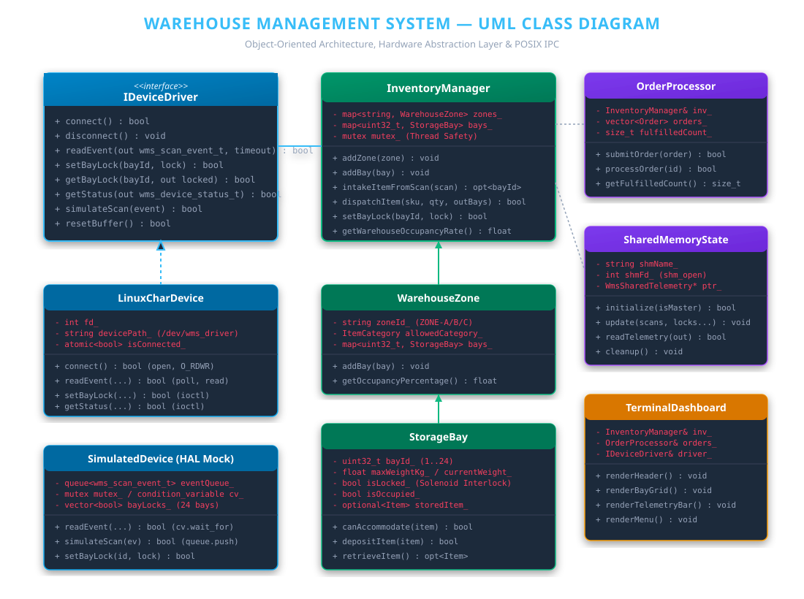
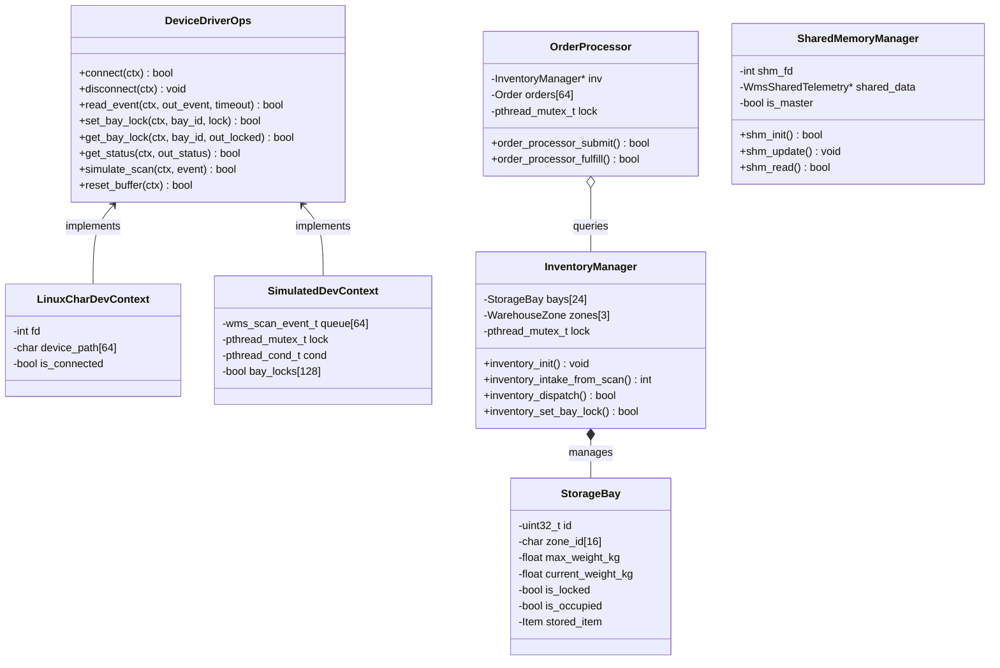
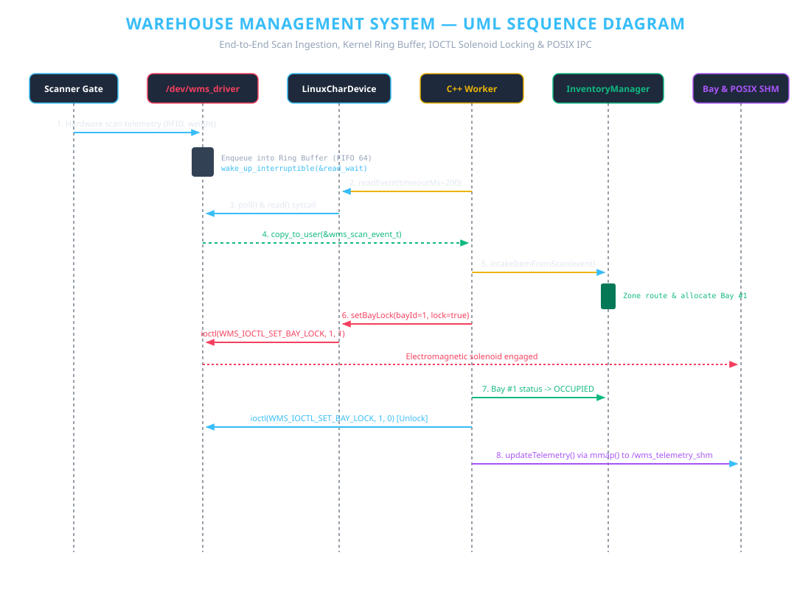
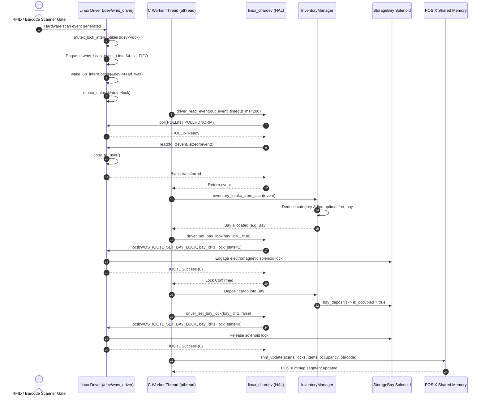
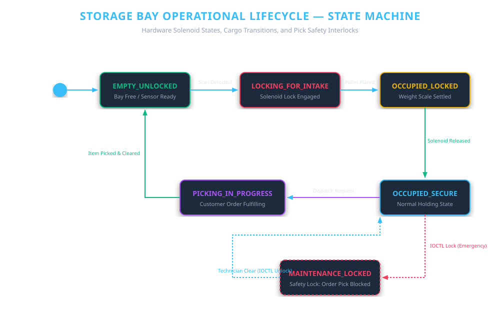

# Warehouse System (WMS - Pure C Edition)
### Using a Linux Character Device Driver, POSIX System Programming & C11

[](https://kernel.org)
[](https://en.wikipedia.org/wiki/C11_(C_standard_revision))
[]()
[]()

An industrial-grade individual capstone engineering project implemented **entirely in pure C (C11 standard)** demonstrating an end-to-end software development lifecycle across **Linux Character Device Drivers**, **POSIX System Programming**, and **Hardware Abstraction Architecture**.

---

## 📑 6-Stage Project Lifecycle & Documentation

This project follows a rigorous 6-stage engineering development process. Full documentation for each stage is available in the [`docs/`](docs/) directory:

| Stage | Milestone | Report File | Key Contents |
|---|---|---|---|
| **Stage 1** | Project Introduction | [`docs/STAGE1_PROJECT_INTRODUCTION.md`](docs/STAGE1_PROJECT_INTRODUCTION.md) | Problem formulation, industrial motivation, project scope, expected outcomes |
| **Stage 2** | Requirements & PRD | [`docs/STAGE2_REQUIREMENTS_PRD.md`](docs/STAGE2_REQUIREMENTS_PRD.md) | Functional & Non-functional requirements, PRD, deliverables matrix, Gantt roadmap |
| **Stage 3** | System Architecture | [`docs/STAGE3_SYSTEM_ARCHITECTURE.md`](docs/STAGE3_SYSTEM_ARCHITECTURE.md) | 3-Tier architecture, UML Class Diagram, Sequence Diagram, State Machine |
| **Stage 4** | Prototype Implementation | [`docs/STAGE4_INITIAL_PROTOTYPE.md`](docs/STAGE4_INITIAL_PROTOTYPE.md) | Kernel driver implementation, C HAL dual-mode, core domain prototype |
| **Stage 5** | Testing & Integration | [`docs/STAGE5_TESTING_AND_INTEGRATION.md`](docs/STAGE5_TESTING_AND_INTEGRATION.md) | Test suites, benchmarks, safety interlock bug fixes, memory verification |
| **Stage 6** | Final Delivery & Presentation | [`docs/STAGE6_FINAL_REPORT_PRESENTATION.md`](docs/STAGE6_FINAL_REPORT_PRESENTATION.md) | Final system evaluation, live demonstration walkthrough, future expansions |

---

## 🏛️ System Architecture

```
+-------------------------------------------------------------------------+
|                  INTERACTIVE TERMINAL & WEB DASHBOARDS                  |
|          (ANSI Live Grid, Browser 24-Bay Visualizer, Menu)              |
+------------------------------------+------------------------------------+
                                     │
+------------------------------------▼------------------------------------+
|                         WAREHOUSE CORE ENGINE (C)                       |
|       (inventory_manager.c, storage_bay.c, warehouse_zone.c, etc.)      |
+-------------------+--------------------------------+--------------------+
                    │                                │
+-------------------▼------------------+   +---------▼--------------------+
|      SYSTEM PROGRAMMING LAYER        |   |  HARDWARE ABSTRACTION LAYER  |
|  - POSIX Shared Memory (/wms_telemetry)  |  - DeviceDriverOps Interface |
|  - POSIX Signals (SIGINT, SIGTERM)   |   |  ├── linux_chardev.c         |
|  - Worker Thread Pool (pthread)      |   |  └── simulated_dev.c (Mock)  |
+--------------------------------------+   +-------------------+----------+
                                                               │
========================= LINUX VFS SYSCALLS ==================│===========
                     open() / read() / write() / ioctl() / poll()
===============================================================│===========
                                                               │
+--------------------------------------------------------------▼----------+
|                  LINUX KERNEL CHARACTER DEVICE DRIVER                   |
|                            (/dev/wms_driver)                            |
|  - Dynamic cdev Allocation        - Kernel Mutex & Wait Queues          |
|  - Circular Event FIFO Buffer     - Custom IOCTL Command Dispatcher     |
+-------------------------------------------------------------------------+
```

---

## 📐 UML Diagrams

### 1. UML Class Diagram
Models the structural modularity, the Hardware Abstraction Layer (HAL) function pointer tables, and the pure C domain data structures:



<details>
<summary><b>Click to expand Mermaid Class Diagram code</b></summary>


</details>

---

### 2. UML Sequence Diagram: Hardware Scan Intake & Bay Locking
Illustrates the interaction flow from the physical RFID/barcode scanner gate through the Linux kernel driver, wait queues, userspace worker thread, automatic zone placement, electromagnetic solenoid actuation via IOCTL, and POSIX shared memory updates:



<details>
<summary><b>Click to expand Mermaid Sequence Diagram code</b></summary>


</details>

---

### 3. UML State Machine Diagram: Storage Bay Operational Lifecycle
Captures the state transitions of individual warehouse storage bays, including hardware electromagnetic interlocks and safety protections:



<details>
<summary><b>Click to expand Mermaid State Machine code</b></summary>

```mermaid
stateDiagram-v2
    [*] --> EMPTY_UNLOCKED: Bay Initialized

    EMPTY_UNLOCKED --> LOCKING_FOR_INTAKE: Scan Detected (write/IOCTL)
    note right of LOCKING_FOR_INTAKE: Solenoid engaged via WMS_IOCTL_SET_BAY_LOCK

    LOCKING_FOR_INTAKE --> OCCUPIED_LOCKED: Pallet Deposited & Load Cell Calibrated
    OCCUPIED_LOCKED --> OCCUPIED_SECURE: Placement Verified & Solenoid Released
    note right of OCCUPIED_SECURE: Normal secure holding state

    OCCUPIED_SECURE --> LOCKING_FOR_PICK: Customer Order Pick Requested
    LOCKING_FOR_PICK --> PICKING_IN_PROGRESS: Solenoid Released & Goods Retrieved
    PICKING_IN_PROGRESS --> EMPTY_UNLOCKED: Pallet Removed & Weight Scale Zeroed

    OCCUPIED_SECURE --> MAINTENANCE_LOCKED: Manual Maintenance Lock (IOCTL)
    MAINTENANCE_LOCKED --> OCCUPIED_SECURE: Maintenance Completed & Lock Released

    note left of MAINTENANCE_LOCKED: Safety Interlock: Order fulfillment is strictly blocked while locked
```
</details>

---

## 🖥️ Interactive Web & Terminal Dashboards

1. **Interactive Web Dashboard (`web/index.html`)**:
   - Modern browser-based 24-bay dynamic rack layout with live color coding (Empty, Occupied, Locked).
   - Interactive clickable padlocks to toggle electromagnetic solenoid locks via IOCTL.
   - Cargo intake scanner simulation, order dispatching with safety interlocks, and POSIX shared memory inspector.
   - Launch with `make dashboard` or double-click [`web/index.html`](web/index.html).

2. **Interactive Terminal Console Dashboard (`./bin/warehouse_system`)**:
   - High-performance ANSI color terminal dashboard with live 24-bay grid, telemetry bar, event stream, and interactive menu in pure C.

---

## 🚀 Quick Start Guide

### 1. Prerequisites (Ubuntu / Linux / WSL2)
Install the standard build essentials and Linux kernel headers:
```bash
sudo apt update
sudo apt install -y build-essential linux-headers-$(uname -r)
```

### 2. Build Everything
Build both the Linux Character Device Driver (`wms_driver.ko`) and the pure C executable:
```bash
make
```

### 3. Run Automated Tests (Pure C)
Execute the comprehensive unit, integration, and stress test suites:
```bash
make test
```

### 4. Run Automated End-to-End System Demo
Run the automated end-to-end demonstration showcasing cargo intake, zone allocation, safety interlock bay locking, customer order fulfillment, and POSIX shared memory telemetry:
```bash
make demo
```

### 5. Launch Interactive Terminal Dashboard
Launch the interactive ANSI dashboard to manually trigger scans, dispatch orders, actuate bay locks via IOCTL, and inspect telemetry:
```bash
./bin/warehouse_system
```

### 6. Launch Interactive Web Dashboard
```bash
make dashboard
# or open web/index.html in any browser
```

---

## 🔌 Kernel Device Driver & IOCTL Interface

The driver exposes the character device node at `/dev/wms_driver`. The shared header [`driver/include/wms_ioctl.h`](driver/include/wms_ioctl.h) defines the hardware control contract:

| IOCTL Command | Direction | Payload Structure | Description |
|---|---|---|---|
| `WMS_IOCTL_GET_STATUS` | `_IOR` | `wms_device_status_t` | Reads driver metrics (total scans, buffer occupancy, dropped events, active locks). |
| `WMS_IOCTL_SET_BAY_LOCK` | `_IOW` | `wms_bay_lock_req_t` | Actuates electromagnetic solenoid lock on target bay ID. |
| `WMS_IOCTL_GET_BAY_LOCK` | `_IOWR` | `wms_bay_lock_req_t` | Queries hardware lock state of target bay ID. |
| `WMS_IOCTL_SIMULATE_SCAN` | `_IOW` | `wms_scan_event_t` | Injects hardware scan telemetry directly into the kernel ring buffer. |
| `WMS_IOCTL_RESET_BUFFER` | `_IO` | None | Resets ring buffer pointers and clears dropped event counters. |

---

## 📁 Repository Directory Structure

```
warehouse-system/
├── Makefile                      # Top-level unified orchestrator (gcc)
├── README.md                     # Master project guide
├── .gitignore                    # Git exclusions
├── driver/                       # Linux Character Device Driver (C)
│   ├── Makefile                  # Kernel module makefile
│   ├── wms_driver.c              # Device driver source (cdev, fops, ioctl)
│   ├── wms_driver.h              # Kernel driver state structures
│   └── include/
│       └── wms_ioctl.h           # Shared IOCTL codes & structures
├── include/                      # C Header Files
│   ├── core/                     # inventory_manager.h, storage_bay.h, warehouse_zone.h, order_processor.h, item.h
│   ├── hal/                      # device_driver.h, linux_chardev.h, simulated_dev.h
│   ├── ipc/                      # shared_memory.h, signal_handler.h
│   └── ui/                       # terminal_ui.h
├── src/                          # Pure C Source Files
│   ├── core/
│   ├── hal/
│   ├── ipc/
│   ├── ui/
│   └── main.c                   # Entry point in pure C
├── web/                          # Interactive Web Dashboard
│   └── index.html                # Visual 24-bay browser interface
├── tests/                        # Comprehensive Test Suites in C
│   └── test_runner.c
├── scripts/                      # Automation & Utility Scripts
│   ├── load_driver.sh
│   ├── unload_driver.sh
│   ├── open_dashboard.sh
│   └── run_demo.sh
└── docs/                         # Formal 6-Stage Reports
    ├── images/                   # Vector SVG UML diagrams
    │   ├── uml_class_diagram.svg
    │   ├── uml_sequence_diagram.svg
    │   └── uml_state_machine.svg
    ├── STAGE1_PROJECT_INTRODUCTION.md
    ├── STAGE2_REQUIREMENTS_PRD.md
    ├── STAGE3_SYSTEM_ARCHITECTURE.md
    ├── STAGE4_INITIAL_PROTOTYPE.md
    ├── STAGE5_TESTING_AND_INTEGRATION.md
    └── STAGE6_FINAL_REPORT_PRESENTATION.md
```

---

## 👨‍💻 Git Progression & Commits
Progressive commits demonstrate continuous evolution across each stage:
- `Stage 1`: Problem formulation, introduction, and scope definition.
- `Stage 2`: PRD, functional/non-functional requirements, and project timeline.
- `Stage 3`: System architecture, UML Class/Sequence/State diagrams, and repo setup.
- `Stage 4`: Kernel driver implementation in C, C HAL, and prototype event intake.
- `Stage 5`: Comprehensive test suite in pure C, safety interlock enhancements, and performance optimizations.
- `Stage 6`: Final working project, terminal dashboard, web visualizer, demo automation, and presentation report.

---

## 📄 License
This project is developed as an academic individual engineering project and is licensed under the **GPL-2.0 / MIT Dual License**.
