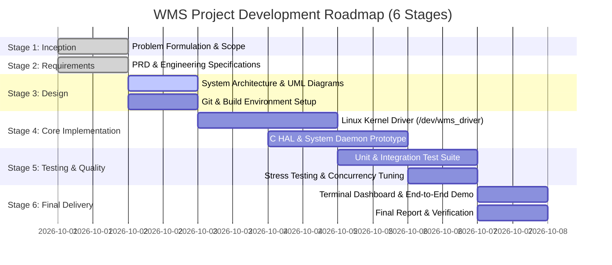

# Stage 2: Project Requirements & Development Plan (PRD)

## 1. Document Control & Overview
- **Project**: Warehouse System (WMS-CharDev - Pure C Edition)
- **Version**: 1.0.0
- **Target OS**: Linux (Ubuntu 22.04 / 24.04 LTS, Kernel 5.x / 6.x)
- **Programming Languages**: C (Kernel Module), Pure C (C11 Standard - User-space Engine)
- **Build System**: GNU Make, GCC

---

## 2. Functional Requirements (FR)

### Module 1: Linux Character Device Driver (`/dev/wms_driver`)
- **FR-1.1: Device Initialization & Teardown**:
  - The driver must dynamically allocate a major number using `alloc_chrdev_region()`.
  - Must automatically create device class and device node `/dev/wms_driver` via `class_create()` and `device_create()`.
  - Clean up all kernel resources upon `rmmod`.
- **FR-1.2: Event Ring Buffer & Wait Queues**:
  - The driver must maintain an internal ring buffer (default capacity: 64 hardware scan events).
  - The buffer must be thread-safe, protected by a kernel `mutex`.
  - `read()` syscall must block on a `wait_queue_head_t` until new scan events are available (or return `-EAGAIN` in `O_NONBLOCK` mode).
  - `poll()` / `select()` support: notify user-space readers when data is available (`POLLIN | POLLRDNORM`).
- **FR-1.3: Hardware Actuation & Sensor Query (`ioctl`)**:
  - `WMS_IOCTL_GET_STATUS`: Return driver statistics (total scans, buffer occupancy, dropped events, active locks).
  - `WMS_IOCTL_SET_BAY_LOCK`: Atomically set or release the electromagnetic lock on a designated warehouse storage bay ID.
  - `WMS_IOCTL_SIMULATE_SCAN`: Allow injection of mock RFID/barcode telemetry directly into the kernel buffer for hardware testing and automated simulation.
  - `WMS_IOCTL_RESET_COUNTERS`: Flush the internal ring buffer and reset telemetry counters.

### Module 2: Hardware Abstraction Layer (HAL) & System Programming
- **FR-2.1: Driver Wrapper (`LinuxCharDevice`)**:
  - Encapsulate file descriptor management (`open`, `close`, `read`, `write`, `ioctl`).
  - Provide an asynchronous event listener using `poll()` in a background worker thread.
- **FR-2.2: Dual-Mode Operation (Kernel & Simulated)**:
  - If `/dev/wms_driver` is absent or the process lacks root/permissions, the HAL seamlessly falls back to a userspace simulation driver (`SimulatedDevice`) matching the exact same interface.
- **FR-2.3: Inter-Process Communication (IPC)**:
  - Maintain a POSIX Shared Memory segment (`/wms_telemetry_shm`) sharing live warehouse capacity, current active order, and sensor counters with auxiliary monitoring processes.
- **FR-2.4: Signal Handling**:
  - Catch `SIGINT` (Ctrl+C) and `SIGTERM` to perform graceful shutdown (releasing bay locks, closing device node, unlinking shared memory).
  - Catch `SIGHUP` to trigger dynamic state reload or inventory printout without process termination.

### Module 3: Warehouse Domain & Business Logic
- **FR-3.1: Inventory Management**:
  - Manage zones (e.g., Zone A: Cold Storage, Zone B: Ambient, Zone C: Hazardous).
  - Organize storage hierarchy: Zone $\rightarrow$ Racks $\rightarrow$ Storage Bays $\rightarrow$ Item slots.
  - Track SKU, Item Name, Category, Quantity, Unit Weight, and Dimensions.
- **FR-3.2: Automated Storage & Retrieval (ASRS)**:
  - When a scan event is received from the device driver, the engine checks if it corresponds to an incoming shipment (Intake) or outgoing order (Dispatch).
  - Automatically allocate an optimal empty bay based on weight and zone restrictions.
- **FR-3.3: Order Processing**:
  - Create and process customer pick-orders.
  - Decrement stock atomically upon fulfillment.

### Module 4: User Interface & Operator Dashboard
- **FR-4.1: Interactive Terminal UI**:
  - Provide ANSI-color dashboard showing:
    - Real-time inventory grid (Bay status: Free, Occupied, Locked).
    - Live hardware driver event stream.
    - System health metrics and POSIX IPC telemetry.
- **FR-4.2: CLI Command Menu**:
  - Options to manually trigger item intake, dispatch orders, query bay status, toggle bay locks via `ioctl`, and inject simulated scans.

---

## 3. Non-Functional Requirements (NFR)

- **NFR-1 (Performance & Latency)**: Event dispatch from driver buffer to C inventory handler must take $< 1\text{ ms}$.
- **NFR-2 (Concurrency & Safety)**: Zero race conditions or deadlocks during concurrent stock updates across multiple worker threads. All shared data protected by POSIX mutexes (`pthread_mutex_t`).
- **NFR-3 (Memory Safety & Kernel Stability)**:
  - Driver must have zero kernel memory leaks (verified with `kmemleak`).
  - C codebase must have zero memory leaks or dangling pointers (verified with Valgrind / AddressSanitizer).
- **NFR-4 (Robust Error Handling)**: Graceful degradation when driver nodes are unmounted or files cannot be opened.
- **NFR-5 (Modularity & Maintainability)**: Clean separation of concerns adhering to modular design principles and separation of Kernel vs. User space.

---

## 4. Deliverables Matrix

| Stage | Deliverable Name | File/Artifact Path | Description |
|---|---|---|---|
| Stage 1 | Project Introduction | `docs/STAGE1_PROJECT_INTRODUCTION.md` | Problem definition, motivation, scope, and industry applications |
| Stage 2 | PRD & Plan | `docs/STAGE2_REQUIREMENTS_PRD.md` | Functional/non-functional requirements, timeline, milestone breakdown |
| Stage 3 | Architecture & UML | `docs/STAGE3_SYSTEM_ARCHITECTURE.md` | System diagrams, UML Class, Sequence, State diagrams, Git setup |
| Stage 4 | Initial Prototype | `driver/`, `src/hal/`, `src/core/` | Working kernel character device, initial C HAL, prototype intake |
| Stage 5 | Testing & Integration | `tests/`, `scripts/`, `docs/STAGE5_*` | Test suites, performance benchmarks, concurrency bug fixes |
| Stage 6 | Final Delivery | Complete source, demo script, docs | End-to-end working system, terminal UI, final project report |

---

## 5. Development Plan & Timeline

---

## 6. Roadmap to Stage 3
In **Stage 3**, we specify the formal **System Architecture**, structural components, data structures, and complete UML diagrams (Class Diagram, Sequence Diagram, and State Machine Diagram), alongside configuring the development environment and Git branching strategy.
