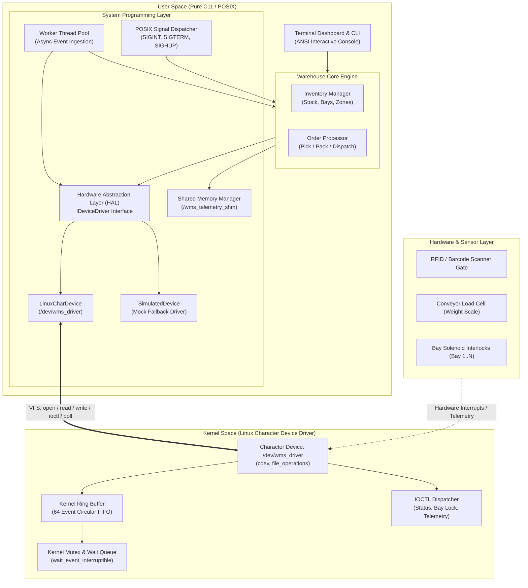
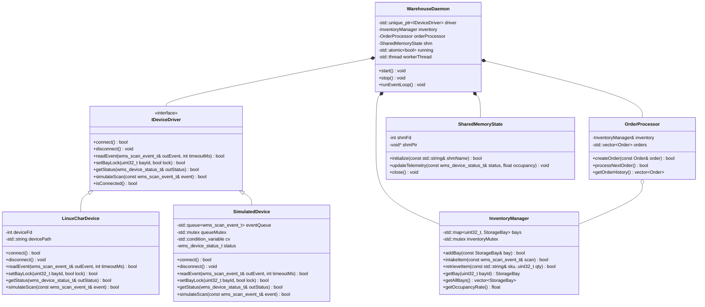
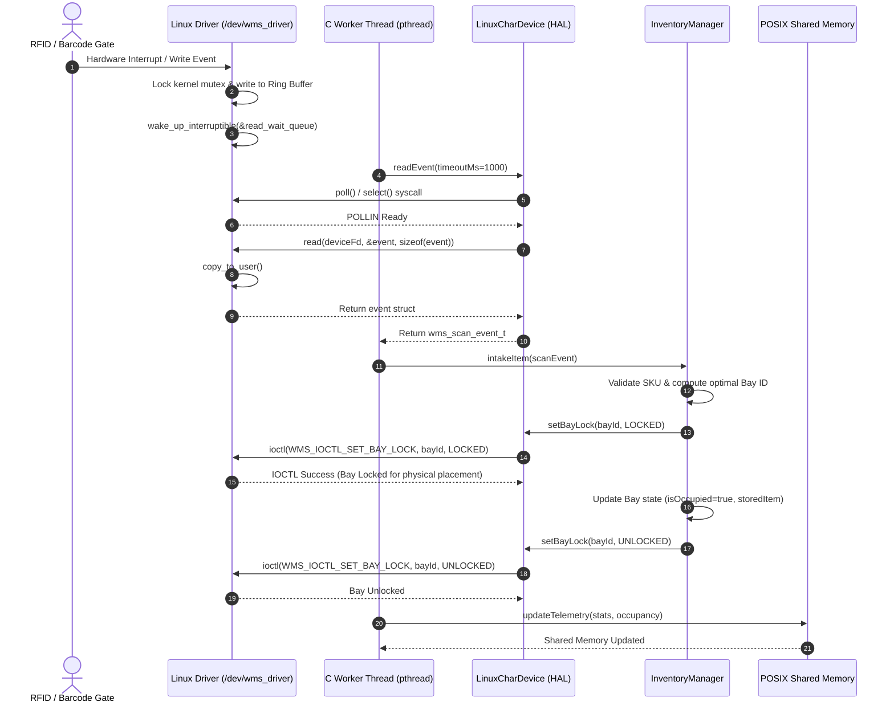
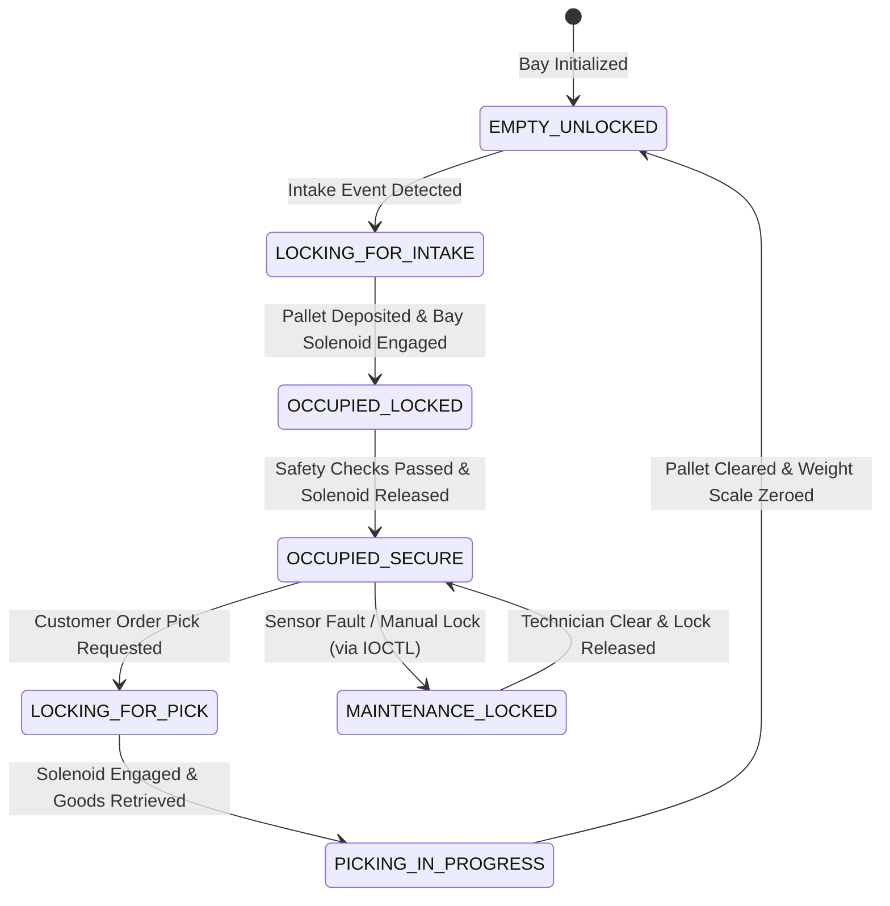

# Stage 3: System Design & Architecture

## 1. System Overview & Architecture

The Warehouse Management System (WMS) is partitioned into three distinct operational tiers:
1. **Kernel Tier (Hardware Interface & Driver)**: A Linux Character Device Driver providing hardware abstraction, buffering, lock synchronization, and IOCTL control.
2. **System Programming Tier (IPC, Signals, HAL)**: Linux system-level primitives including asynchronous polling, POSIX shared memory broadcast, and signal management.
3. **Application & Domain Tier (Pure C11)**: Procedural warehouse domain logic managing storage bays, inventory allocations, order processing, and an interactive dashboard.

### High-Level System Architecture Diagram



---

## 2. Major Components and Responsibilities

| Component | Layer | Primary Responsibility |
|---|---|---|
| `wms_driver.c` | Linux Kernel Space | Manages `/dev/wms_driver`, handles VFS syscalls (`open`, `read`, `write`, `ioctl`, `poll`), thread-safe ring buffer, bay hardware locking. |
| `wms_ioctl.h` | Shared (Kernel/C) | Formal protocol contract between kernel and userspace: IOCTL magic numbers, ioctl codes, and payload structs. |
| `device_driver.h` | C HAL | DeviceDriverOps function pointer interface defining hardware methods (`init`, `read_event`, `set_bay_lock`, `get_status`). |
| `linux_chardev.c` | C HAL | Concrete driver wrapper opening `/dev/wms_driver`, invoking POSIX `poll()` and `ioctl()`. |
| `simulated_dev.c` | C HAL | In-memory emulator mimicking kernel driver behavior for headless testing and non-root execution. |
| `inventory_manager.c` | C Core | Thread-safe in-memory warehouse repository tracking zones, racks, bays, and SKUs with atomic capacity checking. |
| `order_processor.c` | C Core | Processes customer fulfillment orders, validates stock, reserves bays, and dispatches goods. |
| `shared_memory.c` | C IPC | POSIX shared memory publisher exporting real-time warehouse metrics for monitoring clients. |
| `signal_handler.c` | C IPC | Handles POSIX signals (`SIGINT`, `SIGTERM`, `SIGHUP`) ensuring graceful shutdown and zero dangling kernel locks. |
| `terminal_ui.c` | C UI | Renders live warehouse layout, real-time event logs, and an interactive menu. |

---

## 3. Data Structures Specification

### 3.1 Kernel Data Structures (`driver/wms_driver.h` & `include/driver/wms_ioctl.h`)

```c
/* Raw scan event representation passed between kernel and user space */
typedef struct {
    uint32_t event_id;          /* Monotonically increasing event ID */
    uint64_t timestamp_ns;      /* Kernel timestamp (ktime_get_real_ns) */
    char     barcode[32];       /* Scanned SKU or Pallet Barcode */
    float    weight_kg;         /* Weight captured by load-cell scale */
    uint8_t  source_gate_id;    /* Gate/Conveyor ID (1 = Intake, 2 = Dispatch) */
    uint8_t  checksum;          /* Data integrity checksum */
} wms_scan_event_t;

/* Device telemetry returned via WMS_IOCTL_GET_STATUS */
typedef struct {
    uint32_t total_events_logged;
    uint32_t buffer_occupancy;
    uint32_t buffer_capacity;
    uint32_t dropped_events;
    uint32_t active_bay_locks;
    uint8_t  device_ready;
} wms_device_status_t;

/* Bay lock control payload via WMS_IOCTL_SET_BAY_LOCK */
typedef struct {
    uint32_t bay_id;
    uint8_t  lock_state;        /* 1 = Locked, 0 = Unlocked */
} wms_bay_lock_req_t;
```

### 3.2 User Space Domain Structures (`include/core/`)

```cpp
struct Item {
    std::string sku;
    std::string name;
    std::string category;
    float weightKg;
    int quantity;
};

struct StorageBay {
    uint32_t bayId;
    std::string zoneId;
    float maxWeightKg;
    float currentWeightKg;
    bool isLocked;
    bool isOccupied;
    Item storedItem;
};

struct Order {
    std::string orderId;
    std::string customerName;
    std::vector<std::pair<std::string, int>> requestedItems; // SKU, quantity
    bool isFulfilled;
};
```

---

## 4. UML Diagrams

### 4.1 UML Class Diagram
The class diagram captures object-oriented design, inheritance in the HAL, and domain composition.



---

### 4.2 UML Sequence Diagram: Hardware Scan Intake Flow
Depicts the flow from physical barcode scan through the Linux Character Device Driver into user-space processing.



---

### 4.3 UML State Machine Diagram: Storage Bay Lifecycle
Models the dynamic operational states of each individual warehouse storage bay.



---

## 5. Environment Setup & Tooling Configuration

- **Compiler**: GCC 11+ with `-std=c11 -Wall -Wextra -pthread -lrt`
- **Linux Kernel Source**: `/usr/src/linux-headers-$(uname -r)` or generic kernel headers
- **Build Orchestrator**: GNU Make orchestrator
- **Testing Framework**: Native Pure C Test Harness with ANSI color assertions
- **Static Analysis & Sanitizers**: GCC `-fsanitize=address,undefined` and Valgrind

---

## 6. Git Repository & Branching Strategy

We enforce a professional trunk-based / feature-branch Git workflow:
- `main`: Production-ready, fully verified milestone releases.
- `develop`: Ongoing integration branch where tested stages are consolidated.
- `feature/*`: Specific stage feature development (e.g. `feature/stage4-chardev`, `feature/stage5-tests`).
- **Semantic Commits**:
  - `feat:` for new capabilities.
  - `docs:` for design documents and reports.
  - `test:` for unit and integration tests.
  - `fix:` for bug fixes and stability enhancements.

---

## 7. Roadmap to Stage 4
In **Stage 4**, we implement the core prototypes:
1. `driver/wms_driver.c` and `driver/include/wms_ioctl.h`
2. `src/hal/LinuxCharDevice.cpp` & `SimulatedDevice.cpp`
3. `src/core/InventoryManager.cpp`
4. Automated build validation verifying driver compilation and user-space linking.
